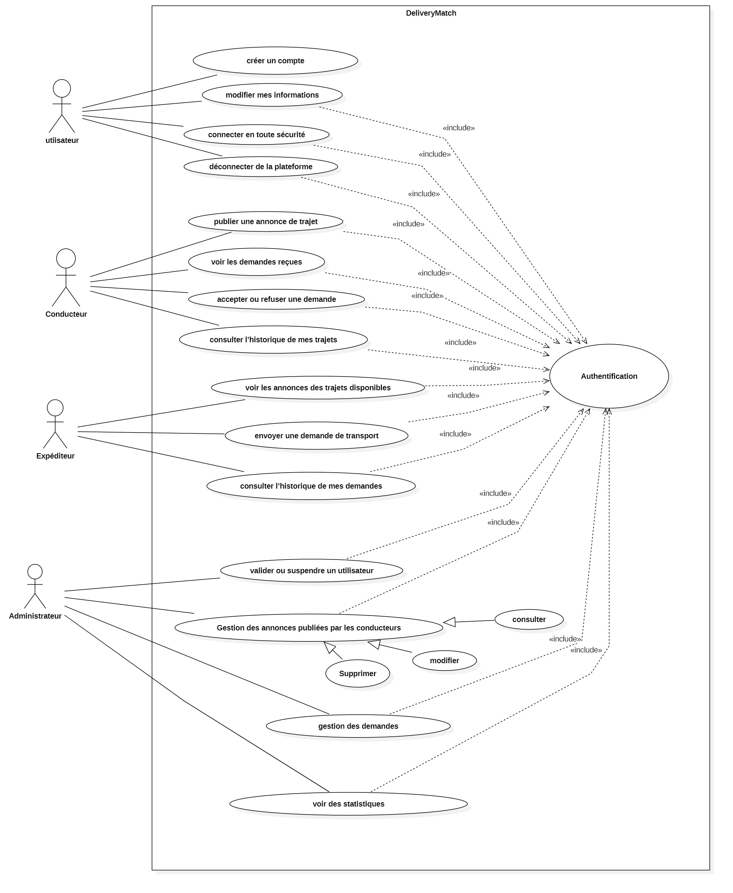
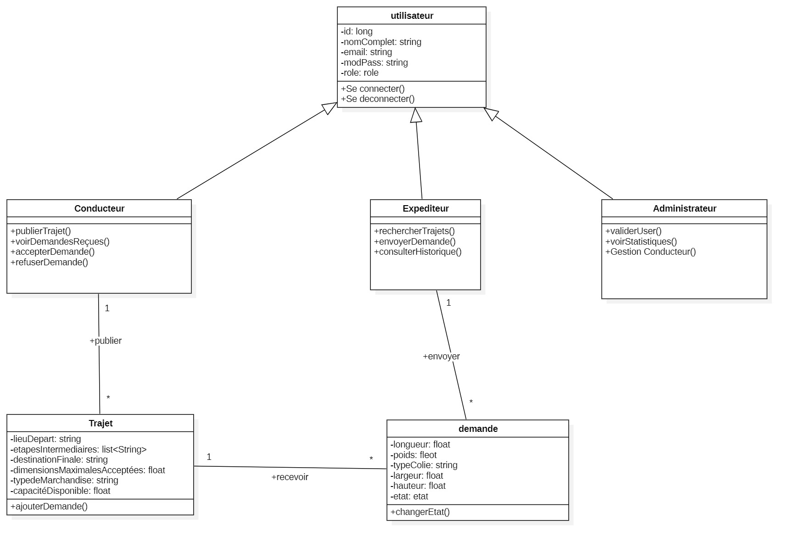
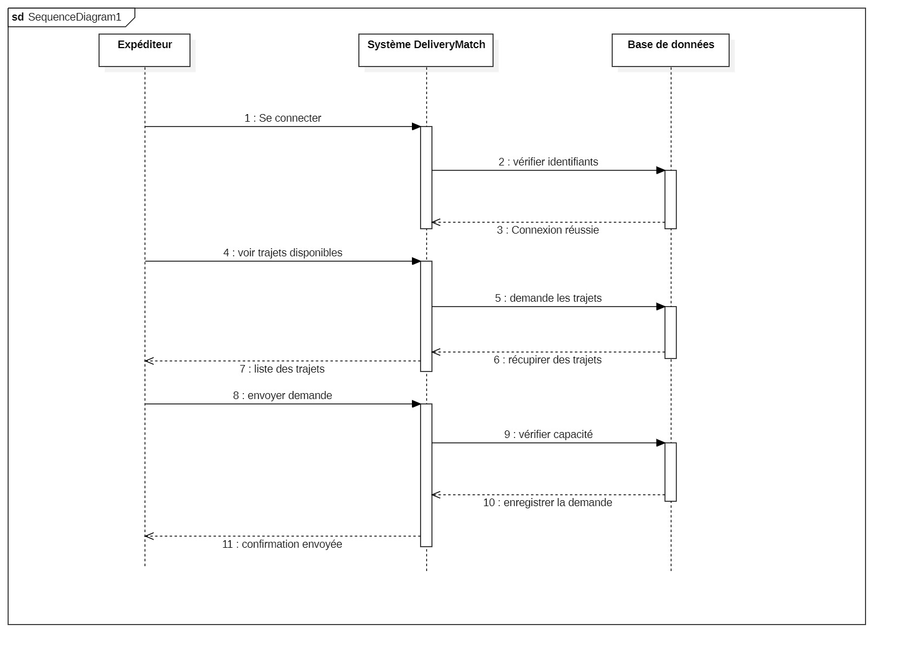

# 🚚 Plateforme de Transport Collaboratif

## 📌 Contexte du Projet

Cette plateforme web permet de mettre en relation des **conducteurs** qui publient des trajets disponibles et des **expéditeurs** qui souhaitent envoyer des colis. Un **administrateur** supervise l’ensemble du système pour garantir la sécurité et la qualité des services.


## ✨ Fonctionnalités Principales

### 👤 Utilisateur
- Créer un compte et se connecter
- Modifier ses informations
- Se déconnecter

### 🚗 Conducteur
- Publier une annonce de trajet (départ, étapes, destination, dimensions, type de marchandise…)
- Voir et gérer les demandes reçues
- Accepter ou refuser les colis
- Consulter l’historique des trajets

### 📦 Expéditeur
- Rechercher des trajets disponibles avec filtres
- Envoyer une demande de transport avec les détails du colis
- Consulter l’historique de ses envois

### 🛠️ Administrateur
- Accéder à un tableau de bord complet (utilisateurs, annonces, demandes…)
- Valider, suspendre ou certifier des utilisateurs (badge "Vérifié")
- Modifier ou supprimer des annonces
- Voir des statistiques graphiques (nombre d’annonces, taux d’acceptation…)


## 🧠 Utilité du Projet

- Favoriser le **transport collaboratif**
- Réduire les trajets à vide des conducteurs
- Offrir une **solution économique et sécurisée** pour l’expédition de colis
- Centraliser les interactions sur une plateforme **moderne et intuitive**


## 🖼️ Diagrammes UML

### 📘 1. Diagramme de Cas d’Utilisation (Use Case)
- Acteurs : Utilisateur, Conducteur, Expéditeur, Administrateur
- 

### 🧱 2. Diagramme de Classes
- 

### 🔄 3. Diagramme de Séquence


## 🧪 Technologies Utilisées

- **Backend** : Spring Boot, Spring Data JPA, Spring Security
- **Frontend** : Angular 16+, Bootstrap/Css, Angular Material, Chart.js
- **Base de données** :MySQL
- **Tests** : JUnit
- **Conteneurisation** : Docker
- **API Docs** : Postman


## 🚀 Lancement du Projet

### 🔧 1. Cloner le projet

```bash
git clone https://github.com/MrRidadev/Application-de-transport-des-colis.git
